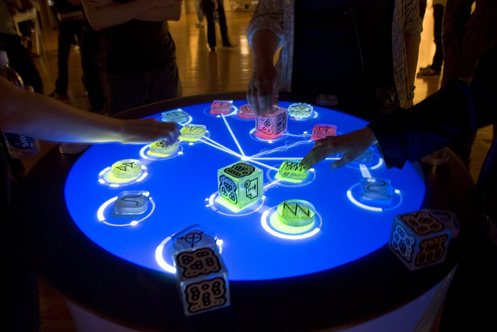

# Tangible User Interface Project (TAN25.11)



Dự án bàn tương tác sử dụng computer vision để nhận diện và theo dõi các đối tượng vật lý, hiển thị giao diện tương tác qua projection mapping.

## ✨ Tính năng chính

- 🎯 **Object Detection**: Nhận diện các khối tangible objects theo màu sắc
- 📍 **Real-time Tracking**: Theo dõi vị trí và góc xoay của đối tượng
- 🎨 **Interactive Visualization**: Hiển thị đồ họa tương tác với hiệu ứng
- 👥 **Multi-user Support**: Hỗ trợ nhiều người dùng cùng lúc
- 🔗 **Dynamic Connections**: Đường kết nối tự động giữa các objects

## 🛠️ Công nghệ sử dụng

- **Python 3.11+**: Ngôn ngữ chính
- **OpenCV 4.8+**: Computer vision và image processing
- **Pygame 2.5+**: Rendering và giao diện
- **NumPy**: Xử lý dữ liệu số
- **SciPy**: Tính toán khoa học

## 📁 Cấu trúc dự án

```
tangible-ui/
├── src/
│   ├── camera/          # Camera capture và calibration
│   │   ├── __init__.py
│   │   └── camera_manager.py
│   ├── detection/       # Object detection và tracking
│   │   ├── __init__.py
│   │   └── object_detector.py
│   ├── visualization/   # Rendering và UI
│   │   ├── __init__.py
│   │   └── ui_renderer.py
│   └── main.py         # Entry point
├── config/             # Configuration files
│   └── settings.json
├── requirements.txt    # Dependencies
├── run.bat            # Windows run script
├── .gitignore
└── LICENSE
```

## 🚀 Cài đặt và chạy

### Yêu cầu hệ thống
- Python 3.11 hoặc cao hơn
- Webcam hoặc camera USB
- Windows/Linux/macOS

### Cài đặt

1. **Clone repository:**
```bash
git clone https://github.com/DYBInh2k5/Tangible-User-Interface-Project.git
cd tangible-ui
```

2. **Cài đặt dependencies:**
```bash
pip install -r requirements.txt
```

3. **Chạy ứng dụng:**

**Windows:**
```bash
run.bat
```

**Linux/macOS:**
```bash
cd src
python main.py
```

## 🎮 Cách sử dụng

1. **Khởi động ứng dụng** - Cửa sổ hiển thị bàn tương tác tròn màu xanh
2. **Chuẩn bị objects** - Sử dụng các khối màu: xanh lá, đỏ, xanh dương
3. **Đặt objects** - Đặt các khối trước camera để nhận diện
4. **Tương tác** - Di chuyển, xoay các khối để xem hiệu ứng
5. **Thoát** - Nhấn ESC để thoát ứng dụng

## ⚙️ Cấu hình

Chỉnh sửa `config/settings.json` để tùy chỉnh:

- **Camera settings**: Resolution, FPS, device ID
- **Detection parameters**: Color ranges, contour thresholds
- **Display settings**: Screen resolution, fullscreen mode
- **UI parameters**: Animation speed, connection thresholds

## 🎨 Màu sắc objects được hỗ trợ

| Màu | HSV Range | Mô tả |
|-----|-----------|-------|
| 🟢 Xanh lá | H: 40-80, S: 50-255, V: 50-255 | Green cubes |
| 🔴 Đỏ | H: 0-10, S: 50-255, V: 50-255 | Red cubes |
| 🔵 Xanh dương | H: 100-130, S: 50-255, V: 50-255 | Blue cubes |

## 🤝 Đóng góp

1. Fork repository
2. Tạo feature branch (`git checkout -b feature/AmazingFeature`)
3. Commit changes (`git commit -m 'Add some AmazingFeature'`)
4. Push to branch (`git push origin feature/AmazingFeature`)
5. Tạo Pull Request

## 📝 License

Distributed under the MIT License. See `LICENSE` for more information.

## 📧 Liên hệ

Project Link: [https://github.com/DYBInh2k5/Tangible-User-Interface-Project](https://github.com/DYBInh2k5/Tangible-User-Interface-Project)

## 🙏 Acknowledgments

- OpenCV community
- Pygame developers
- Computer vision research community